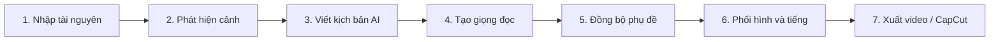

<!-- markdownlint-disable MD060 MD040 MD041 MD047 -->

<div align="center">


[](https://github.com/npnhatduy2019/vynaro/releases)
[](https://tauri.app)
[](https://www.rust-lang.org)
[](https://react.dev)
[](LICENSE)

**Studio AI trên máy tính dành cho video kể chuyện, thuyết minh phim và nội dung ngắn.**

[Trang tài liệu](https://agions.github.io/vynaro/) · [Báo lỗi](https://github.com/npnhatduy2019/vynaro/issues) · [Bản phát hành](https://github.com/npnhatduy2019/vynaro/releases)

</div>

---

## Vynaro là gì?

**Vynaro** là ứng dụng desktop mã nguồn mở được xây dựng bằng **Tauri 2, Rust, React 19 và TypeScript**. Ứng dụng giúp chuyển video gốc thành sản phẩm kể chuyện hoặc thuyết minh hoàn chỉnh thông qua một quy trình trực quan gồm 7 bước.

Vynaro hướng tới người làm nội dung ngắn, kênh thuyết minh phim, biên tập viên video và nhóm sáng tạo cần một quy trình xử lý cục bộ, có thể kiểm soát và dễ mở rộng.

## Quy trình 7 bước



| Bước | Chức năng | Kết quả chính |
| --- | --- | --- |
| 1 | Nhập video và kiểm tra định dạng | Thông tin codec, FPS, độ phân giải và ảnh thu nhỏ |
| 2 | Phát hiện chuyển cảnh bằng FFmpeg | Danh sách cảnh và đoạn nổi bật |
| 3 | Viết lời kể bằng LLM | Kịch bản ngôi thứ nhất hoặc thuyết minh |
| 4 | Tổng hợp giọng nói TTS | Tệp giọng đọc từ Edge TTS, OpenAI TTS hoặc GPT-SoVITS |
| 5 | Tạo và căn chỉnh phụ đề | SRT, VTT hoặc ASS theo mốc thời gian |
| 6 | Phối video, lời đọc và nhạc nền | Timeline nhiều lớp đã đồng bộ |
| 7 | Xuất thành phẩm | Video theo nền tảng hoặc bản nháp CapCut |

## Giao diện

<div align="center">

| Bảng điều khiển | Trung tâm dự án |
| :---: | :---: |
|  |  |

| Quy trình sản xuất | Cài đặt AI và TTS |
| :---: | :---: |
|  |  |

</div>

## Công nghệ và khả năng

- **Ứng dụng desktop đa nền tảng:** Tauri 2 + Rust.
- **Giao diện:** React 19, TypeScript và TanStack Router.
- **Xử lý video:** FFmpeg, phát hiện cảnh, trộn nhiều luồng âm thanh.
- **Mô hình AI:** OpenAI, Claude, Gemini, DeepSeek, Qwen, Kimi, GLM, Doubao, Hunyuan và mô hình cục bộ.
- **Giọng đọc:** Edge TTS, OpenAI TTS và GPT-SoVITS.
- **Phụ đề:** VAD, SRT, VTT và ASS.
- **Xuất bản:** video đa tỷ lệ và bản nháp CapCut.
- **Ngôn ngữ:** tiếng Việt, tiếng Anh và tiếng Trung giản thể.

## Cấu trúc dự án

```text
vynaro/
├── src/                  # Giao diện React + TypeScript
├── src-tauri/            # Ứng dụng desktop Tauri
├── crates/               # Các mô-đun Rust theo nghiệp vụ
├── docs/                 # Website tài liệu VitePress
├── resources/            # Biểu tượng và tài nguyên đóng gói
└── scripts/              # Công cụ kiểm tra và sinh mã
```

## Cài đặt môi trường phát triển

### Yêu cầu

- Node.js 20 trở lên
- pnpm
- Rust stable
- Các thư viện hệ thống theo yêu cầu của Tauri 2
- FFmpeg trong biến môi trường `PATH`

### Chạy ứng dụng

```bash
git clone https://github.com/npnhatduy2019/vynaro.git
cd vynaro
pnpm install
pnpm tauri dev
```

### Kiểm tra mã nguồn

```bash
pnpm typecheck
pnpm lint
pnpm test
cargo check --workspace
cargo test --workspace
```

## Tài liệu

- [Cài đặt](docs/guide/installation.md)
- [Bắt đầu nhanh](docs/guide/quick-start.md)
- [Làm quen giao diện](docs/guide/interface.md)
- [Cấu hình AI](docs/guide/ai-configuration.md)
- [Xuất video](docs/guide/exporting.md)
- [Khắc phục sự cố](docs/guide/troubleshooting.md)

## Đóng góp

Mọi đóng góp đều được hoan nghênh. Hãy tạo issue để mô tả lỗi hoặc đề xuất, sau đó gửi pull request với phạm vi thay đổi rõ ràng và kết quả kiểm tra tương ứng.

## Giấy phép

Dự án được phát hành theo [MIT License](LICENSE).

> Bản fork này ưu tiên trải nghiệm tiếng Việt và tiếp tục kế thừa giấy phép, kiến trúc cùng ghi nhận tác giả của dự án gốc.
